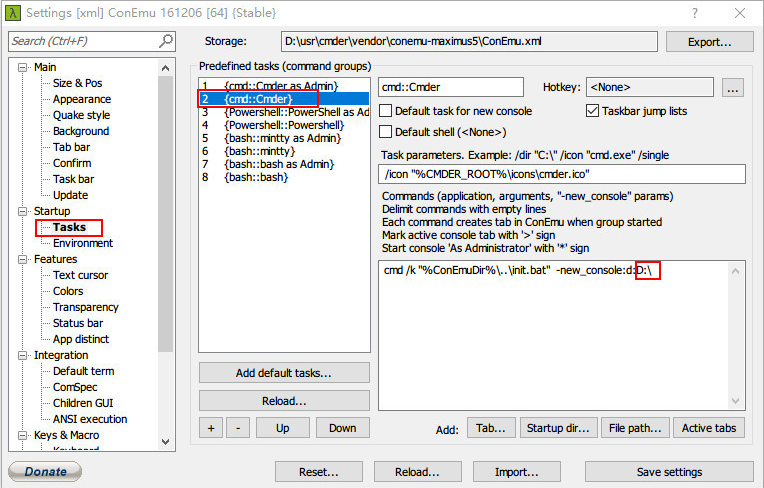

## Change cmder initial position
```
Open setting list
    win + alt + p
Choose Startup-Task
    
Modified the %USERPROFILE% as you want
    *cmd /k "%ConEmuDir%\..\init.bat"  -new_console:d:%USERPROFILE%
```
